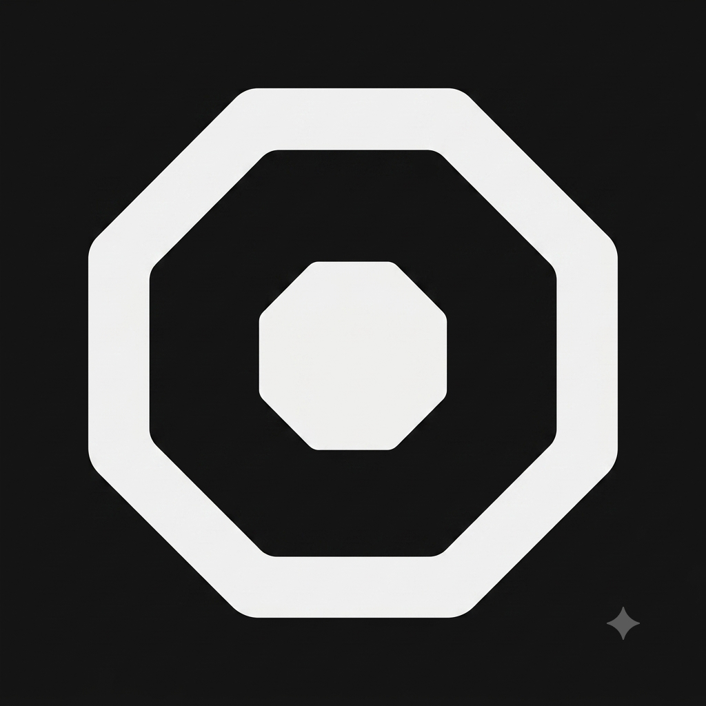

<div align="center">
  
  
  # project-oxi
  
  **Rust-native AI agent ecosystem — built for agents that work, not just talk.**
  
  <a href="https://www.rust-lang.org/"></a>
  &nbsp;
  <a href="https://github.com/project-oxi/.github/blob/main/DESIGN.md"></a>
  &nbsp;
  
</div>

---

## Ecosystem

Three pillars hold up the stack: a **coding agent**, a **browser**, and an **operating system** — all pure Rust, all in-process. Surrounding them are consumer apps that share the same design language and agent-first philosophy.

### ◳ Core Infrastructure

| Project | What it does | Stack |
|---------|-------------|-------|
| [**oxicode**](https://github.com/project-oxi/oxicode) | Terminal AI coding assistant. Multi-provider LLM, streaming-first, session branching, skill system, native/WASM extensions. | Rust · Ratatui TUI · 11 workspace crates |
| [**oxibrowser**](https://github.com/project-oxi/oxibrowser) | Headless browser in pure Rust — not a Chromium fork. Own JS engine, stealth TLS, CDP-compatible. 24 MB binary, ~50 ms cold start. | Rust · boa_engine · html5ever · BoringSSL |
| [**oxios**](https://github.com/project-oxi/oxios) | Agent Operating System. Supervisor, scheduler, vector memory, MCP/A2A, Ouroboros spec framework, RBAC with Merkle audit trail. Zero containers. | Rust daemon (~67 KLOC) · embedded React 19 dashboard |

### ◳ Applications

| Project | What it does | Stack |
|---------|-------------|-------|
| [**oxinot**](https://github.com/project-oxi/oxinot) | Capture a thought before it's gone. Card-based note app for macOS. Plain `.md` files, rebuildable index, BM25 full-text search, CLI parity for agents. | Tauri 2 · React 19 · redb + tantivy |
| [**oxipage**](https://github.com/project-oxi/oxipage) | Personal site generator for humans and AI agents. Blog, portfolio, novels, reviews from one CLI. 9 extensions, bilingual EN/KO. | Rust SSG · Axum console · embedded React SPA |
| **oxiline** *(in development)* | Routine & day-flow management. Time as a playhead, routines as lanes, global-hotkey floating HUD. | Tauri 2 · React 19 · SQLite · Rust core |

### ◳ Utilities

| Project | What it does |
|---------|-------------|
| **oxicleaner** | Recursive `cargo target/` cleaner with launchd scheduling. Recovered ~280 GB on the dev machine. |

---

## How they connect

```
                          project-oxi
                    ┌──────────────────────┐
                    │   shared design      │
                    │   shared philosophy   │
                    │   shared conventions  │
                    └──────────┬───────────┘
                               │
           ┌───────────────────┼───────────────────┐
           │                   │                   │
     ┌─────┴─────┐     ┌──────┴──────┐     ┌──────┴──────┐
     │  oxicode  │     │ oxibrowser  │     │   oxios     │
     │  (agent)  │     │ (engine)    │     │  (runtime)  │
     └─────┬─────┘     └──────┬──────┘     └──────┬──────┘
           │                  │                   │
           │           embedded into              │
           │──────────────────┼──────────────────▶│
           │                  │                   │
           │         ┌────────┴────────┐          │
           │         │  oxinot         │          │
           │         │  oxipage        │          │
           │         │  oxiline        │          │
           │         │ (consumer apps) │          │
           │         └─────────────────┘          │
           │                                      │
           └──────────── all share ───────────────┘
                      OKLCH tokens
                      CLI / agent parity
                      plain-file storage
```

- **oxios** embeds **oxibrowser** as its in-process browsing engine.
- **oxicode** and **oxios** share the agent runtime patterns (sessions, skills, multi-provider).
- **oxinot**, **oxipage**, **oxiline** are standalone apps that share the design system and agent-first conventions.

---

## Design System

Every project in the ecosystem follows one visual language: **ink-on-paper minimalism**.

| Aspect | Standard |
|--------|----------|
| Color | OKLCH tokens — six label hues, APCA-verified contrast, `.dark` class theming |
| Typography | SUIT (body, sans) + SUITE (headline, sans) — density contrast, no serif |
| Dark mode | `.dark` class, no `dark:` variants in components, FOUC-safe inline script |
| Borders | `box-shadow` on inputs (no layout shift), hairline `border-line` elsewhere |
| Philosophy | Weight-led hierarchy, information density over decoration |

**Full specification:** [`DESIGN.md`](../DESIGN.md) (1,100+ lines — the single source of truth for the oxi brand across all projects)

---

## Principles

**Rust-native.** No Electron, no Node runtime, no containers. Pure Rust cores with thin TypeScript frontends.

**Agent-first.** Every GUI operation is also a CLI operation with JSON/NDJSON output. Humans and agents use the same interface.

**Plain files.** Markdown + TOML frontmatter. No proprietary databases as source of truth. `grep` works. The index is a rebuildable cache, not a dependency.

**In-process.** Zero subprocess browsers. Zero containerized agents. Everything talks directly — no serialization tax, no cold-start penalty.

**Minimal by default.** Hairline borders, not boxes. Weight, not color, carries hierarchy. Decoration exists only when it earns its place.

---

## Conventions

| | Standard |
|---|---|
| **Rust** | Edition 2024, MIT license, `rust-toolchain` pinning, changelogs |
| **Frontend** | React 19, Tailwind CSS 4, OKLCH design tokens |
| **Desktop** | Tauri 2, Apple Silicon native |
| **Storage** | Plain `.md` / `.toml` / `.jsonl` — rebuildable indexes only |
| **Docs** | `doc/` directory with numbered sections (Korean or English) |
| **CI** | GitHub Actions, clippy + tests on every push |

---

<div align="center">
  <sub>The octagon mark: concentric layers — core runtime, surrounding services, the ecosystem at large.</sub>
</div>
